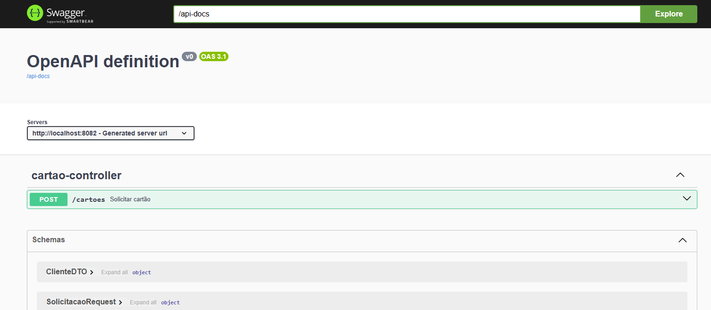

# Api Cartões

This project is a API for request cards, built with Kotlin.

## Description

This project is a REST API built with Kotlin and Spring Boot. The API provides functionalities to to request credit cards and receive responses indicating which cards have been approved. It is designed to be scalable, efficient, and easy to maintain, following best practices of clean architecture, clean code principles, and modern development standards.

## Index

- [About](#about)
- [Techonologies](#techonologies)
- [Getting Started](#getting-started)
- [Project Structure](#project-structure)
- [Tests](#tests)
- [Usage Example](#usage-example)
- [API Documentation](#api-documentation)
- [License](#license)

## About

This project is a REST API built with Kotlin and Spring Boot. The API provides functionalities to to request credit cards and receive responses indicating which cards have been approved. It is designed to be scalable, efficient, and easy to maintain, following best practices of clean architecture, clean code principles, and modern development standards.

## Techonologies

- **Kotlin**: Modern programming language that runs on the JVM, supporting reactive and asynchronous programming with coroutines, suspend functions, etc.
- **Spring Boot**: Framework for building Java or Kotlin applications based on microservices.
- **Spring WebFlux**: For reactive applications.
- **Resilience4j**: Implementation of **Circuit Breaker**, **Rate Limiting**, **Retry**, and **Bulkhead**.
- **Micrometer**: Metrics and monitoring library.
- **JUnit 5**: Framework for unit testing.
- **Docker**: For containerizing the application.
- **GitHub Actions**: For CI/CD (optional).

## Getting Started

### Prerequisites

- Make sure you have the following tools installed on your machine:

- **Java 21 or higher**
- **Kotlin**
- **Maven** 
- **Docker** (if you are using containerization)

### Installing

1. Clone the repository:
    ```sh
    https://github.com/guigon95/api-cartoes.git
    cd api-cartoes
    ```

2. Install dependencies:
    ```sh
    mvn clean install
    ```

### Running the Application

To run the application, use the following command:
```sh
mvn spring-boot:run
```


The server will start on http://localhost:8080.

### Running the Application with Docker

To run the application in a Docker container, follow these steps:

1. **Build the Docker image:**

   ```sh
   docker build -t api-cartoes .
   ```

2. **Run the Docker container:**

   ```sh
   docker run -p 8080:8080 api-cartoes
   ```

This will build the Docker image and run the container, exposing the application on port 8080. You can access the application at `http://localhost:8080`.

## Project Structure

The project structure follows the principles of Clean Architecture and is organized as follows:

```
src/
├── main/
│   ├── kotlin/
│   │   ├── com/
│   │   │   ├── guigon.api_cartoes/
│   │   │   │   ├── application/        # Use cases and ports
│   │   │   │   ├── domain/             # Domain logic (entities, rules)
│   │   │   │   ├── infrastructure/     # Implementation of external interactions (e.g., database, APIs)
│   │   │   │   ├── interfaceadapters/  # Controllers, adapters, etc.
│   └── resources/
│       ├── application.properties      # Spring Boot configurations
│       ├── logback.xml                 # Log configuration (if needed)
├── test/
│   ├── kotlin/
│   │   ├── com/
│   │   │   ├── guigon.api_cartoes/
│   │   │   │   ├── application/        # Use case tests
│   │   │   │   ├── domain/             # Business rule tests
│   │   │   │   ├── infrastructure/     # External interaction tests
│   │   │   │   ├── interfaceadapters/  # Controller and adapter tests
```

## Tests

### Unit Tests
The project uses JUnit 5 for unit tests. You can run the tests with the following commands:

Using Maven:
```sh
./mvnw test
```

### Usage Example

Here is an example of how to use the API to request a credit card:

1. **Request a Credit Card**

   Send a POST request to the `/cartoes` endpoint with the following JSON payload:

   ```json
   {
     "cliente": {
       "nome": "João da Silva",
       "cpf": "123.456.789-00",
       "idade": 30,
       "data_nascimento": "1990-01-01",
       "uf": "SP",
       "renda_mensal": 1000,
       "email": "joao@email.com",
       "telefone_whatsapp": "11999999999"
     }
   }
   ```

2. **Response**

   The API will respond with a JSON object indicating the request details and the offered cards:

   ```json
   {
     "numero_solicitacao": "123e4567-e89b-12d3-a456-426614174000",
     "data_solicitacao": "2025-03-28T21:48:32.896",
     "cliente": {
       "nome": "João da Silva",
       "cpf": "123.456.789-00",
       "idade": 30,
       "data_nascimento": "1990-01-01",
       "uf": "SP",
       "renda_mensal": 1000,
       "email": "joao@email.com",
       "telefone_whatsapp": "11999999999"
     },
     "cartoes_ofertados": [
       {
         "tipo_cartao": "CARTAO_SEM_ANUIDADE",
         "valor_anuidade_mensal": 0,
         "valor_limite_disponivel": 1000,
         "status": "APROVADO"
       }
     ]
   }
   ```

## API Documentation
The API documentation is available in the docs/swagger.json file. You can use Swagger UI to visualize and interact with the API.


link: http://localhost:8080/swagger-ui/index.html




### License
This project is licensed under the Apache 2.0 License - see the LICENSE file for details.